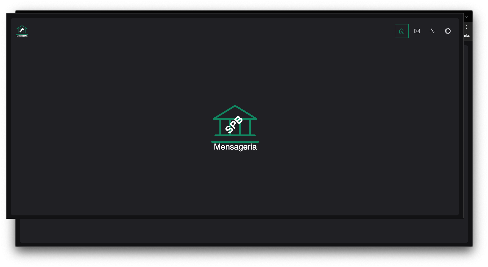
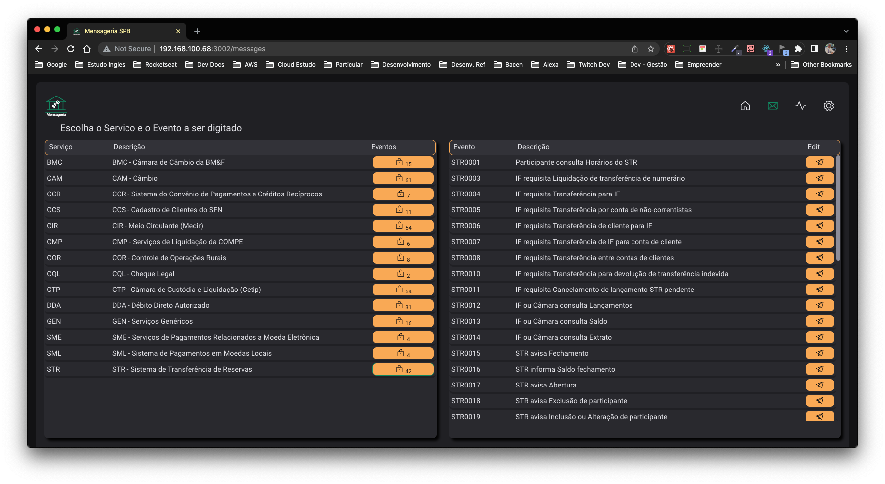
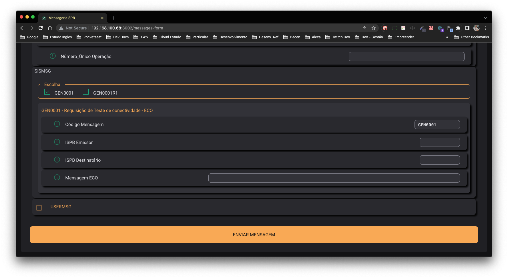
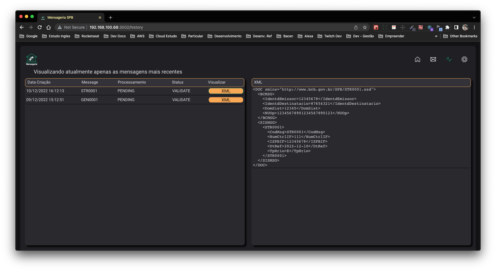
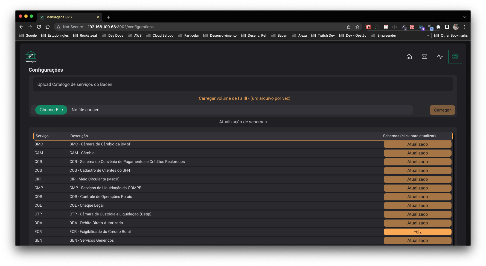

# spb-web-msg

<div align="center" style="display: flex ;flex-direction: column; align-items: center; justify-content: flex-start;">


  


  
</div>

</br>
<h1 align="center">
  
</h1>

<h4 align="center"> 
	🚧  SPB Mensageria em Desenvolvimento 🚧
</h4>
</br>

<p align="center">
 <a href="#-sobre-o-projeto">Sobre</a> •
 <a href="#-funcionalidades-atuais">Funcionalidades</a> •
 <a href="#-layout">Layout</a> • 
 <a href="#-como-executar-o-projeto">Como executar</a> • 
 <a href="#-tecnologias">Tecnologias</a> • 
 <a href="#-autor">Autor</a> • 
 <a href="#user-content--licença">Licença</a>
</p>


## 🏛 Sobre o projeto

SPB Mensageria WEB - Objetivo desta interface é iteragir, Enviar e Receber mensagens do Sistema de Pagamentos Brasileiro (SPB).

Projeto em desenvolvido com poucas funcionalidades.

---

## ⚙️ Funcionalidades Atuais

- [x]  configuração:
  - [x] possibilita fazer upload no server do projeto dos catalogos I a III do Bacen 
  - [x] aciona a conversão de schemas por grupo de serviços para uso de edição e envio de mensagem no formato xml 

- [x] Mensagens por serviço:
  - [x] escolher o serviço e mensagem a ser editada
  - [x] a mensagem será mostrada em nova pagina para edição e evio de mensagem para o servidor para validação e gravação no Banco de dados 

- [x] Histórico de mensagens:
  - [x] Escolher a mensagem a ser exibida e mostrar o xml gerado na edição e envio da mensagem
 
---

## 🎨 Layout Web


<div align="center" style="display: flex-column; align-items: flex-center; justify-content: center;">
  

  

  

  

  
</p>
</div>

---

## 🚀 Como executar o projeto

Este projeto é divido em duas partes:
1. Frontend (este repositório)
2. Backend (repositório spb_srv) 


💡O Frontend precisa que o Backend esteja sendo executado para funcionar.

### Pré-requisitos

Antes de começar, você vai precisar ter instalado em sua máquina as seguintes ferramentas:
[Git](https://git-scm.com), [Node.js](https://nodejs.org/en/). 
Além disto é bom ter um editor para trabalhar com o código como [VSCode](https://code.visualstudio.com/)

#### 🧭 Rodando a aplicação web (Frontend)

```bash

# Clone este repositório
$ git clone https://github.com/MiguelDuqueFilho/spb-web-msg.git

# Acesse a pasta do projeto no terminal/cmd
$ cd spb-web-msg

# Instale as dependências
$ npm install

# Execute a aplicação em modo de desenvolvimento
$ npm run dev

# O node inciará na porta:3002 - acesse http://localhost:3002 

```

---

## 🛠 Tecnologias

As principais ferramentas foram usadas na construção do projeto:

#### **Website**  ([React](https://reactjs.org/)  +  [TypeScript](https://www.typescriptlang.org/))

-   **[React Router Dom](https://github.com/ReactTraining/react-router/tree/master/packages/react-router-dom)**
-   **[Styled Components](https://github.com/styled-components/styled-components)**
-   **[Axios](https://github.com/axios/axios)**
-   **[Phosphor React](https://github.com/phosphor-icons/phosphor-react/)**
-   **[React Hook Form](https://www.npmjs.com/package/react-hook-form)**
-   **[React Toastify](https://fkhadra.github.io/react-toastify/introduction)**

> Veja o arquivo  [package.json](https://github.com/MiguelDuqueFilho/spb-web-msg/blob/main/package.json)

<!-- 
## 👨‍💻 Contribuidores

1. Faça um **fork** do projeto.
2. Crie uma nova branch com as suas alterações: `git checkout -b my-feature`
3. Salve as alterações e crie uma mensagem de commit contando o que você fez: `git commit -m "feature: My new feature"`
4. Envie as suas alterações: `git push origin my-feature`
> Caso tenha alguma dúvida confira este [guia de como contribuir no GitHub](./CONTRIBUTING.md) -->

---

## 🦸 Autor

<a href="#">
 
 <br />
 <sub><b>Miguel Duque Filho</b></sub></a> 
 <br />

---

## 📝 Licença

Este projeto esta sobe a licença [MIT].

Feito com ❤️ por Miguel Duque Filho 


